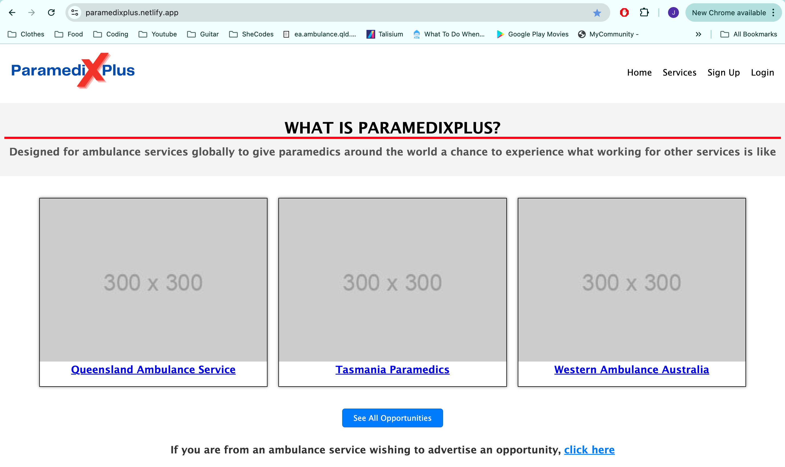
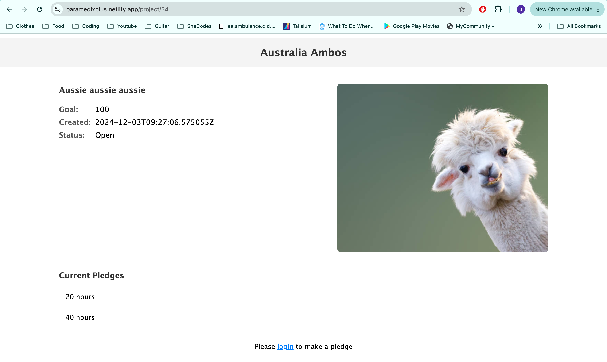
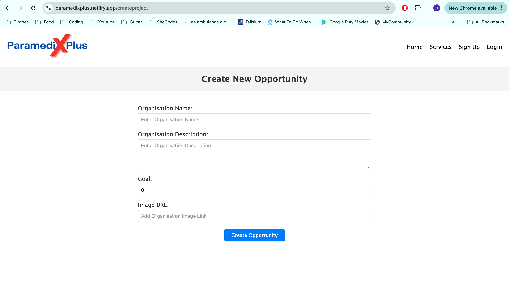

# Crowdfunding Front End

## Overview
#### ParimediX Plus
Empowering paramedics to gain real-world experience with other ambulance services through work exchange opportunities. ParimediX Plus is a unique crowdfunding platform tailored specifically for paramedics. Built using React for the front-end and Django Rest Framework for the back-end, the app enables paramedics and ambulance services to collaborate by offering and pledging work experience hours.

[ParimediXPlus](https://paramedixplus.netlify.app/)

### User Stories
- **Sally's Experience:** Sally, a paramedic from Queensland, can pledge 20 hours to the NSW Ambulance Service to explore interstate work protocols and experiences.
- **Cross-State Collaboration:** The Queensland Ambulance Service can invite paramedics from NSW to do ride-along shifts, fostering knowledge exchange between services.

## Critical Features
User Accounts:
- Create and manage user profiles.
- Log in with token-based authentication.
Project Creation:
- Paramedics or ambulance services can create projects (e.g., "Ride Along with NSW Ambulance").
- Projects include details like title, description, target hours, and an image.
Pledging System:
- Users can pledge hours to support a project.
- Pledges include an optional comment.
Permissions and Security:
- Only project owners can update or delete their projects.
- Suitable permissions control who can delete pledges.
Responsive Design
- Optimized for use on desktop and mobile devices.
Error Handling
- Error pages provide user-friendly feedback.

## Tech Stack
###Front-End
- React
- React Router for navigation
- Axios for API integration
- CSS for responsive design

## Screenshots
Homepage

Project Page

Create Project Page

## Future Enhancements
Integration of messaging between users and ambulance services.
Advanced analytics for ambulance services to track pledged hours.
Support for international ambulance service collaborations.

